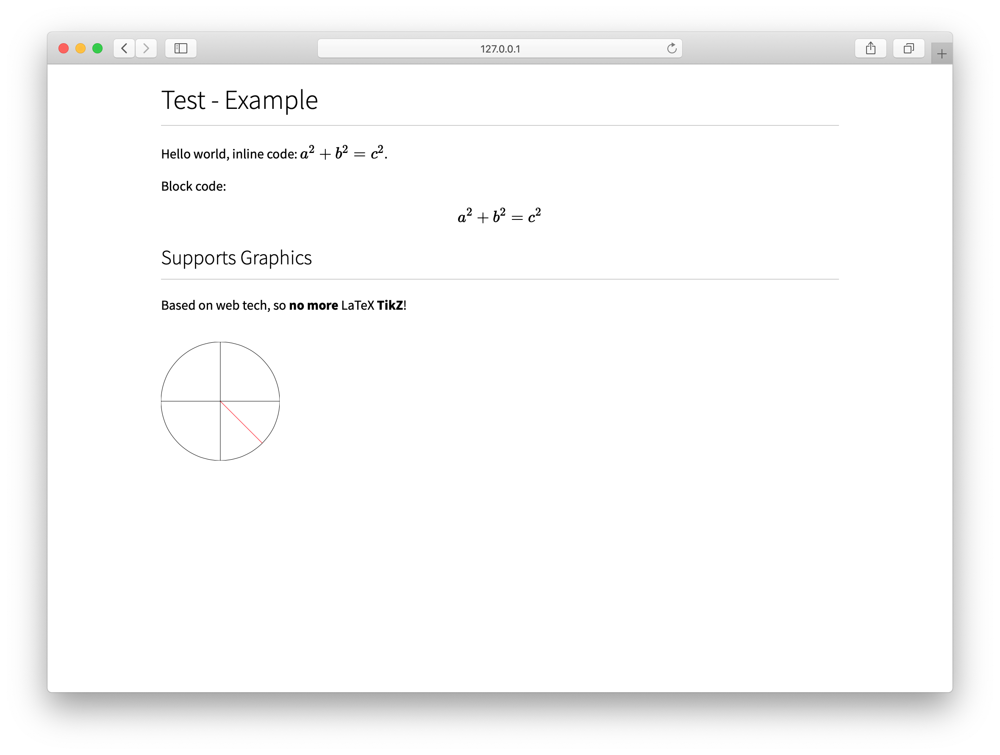

# Typesetting using Web Technologies

## High Level TODO: 

- [CSS Paged Media](https://www.w3.org/TR/css-page-3/): support traditional print use cases, or just rendering to a PDF. This is what I am currently planning on using for rendering to e.g. PDFs: [PagedJS](https://www.pagedjs.org)

## Preview

